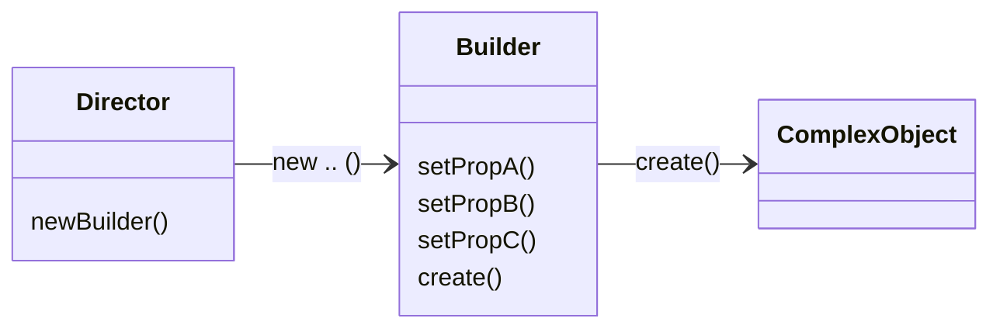

# Builder Pattern

```mermaid
classDiagram
  direction LR
  class Director {
    newBuilder()
  }

  class Builder {
    setPropA()
    setPropB()
    setPropC()

    create()
  }
  Director --> Builder : new .. ()


  Builder --> ComplexObject : create()
```

